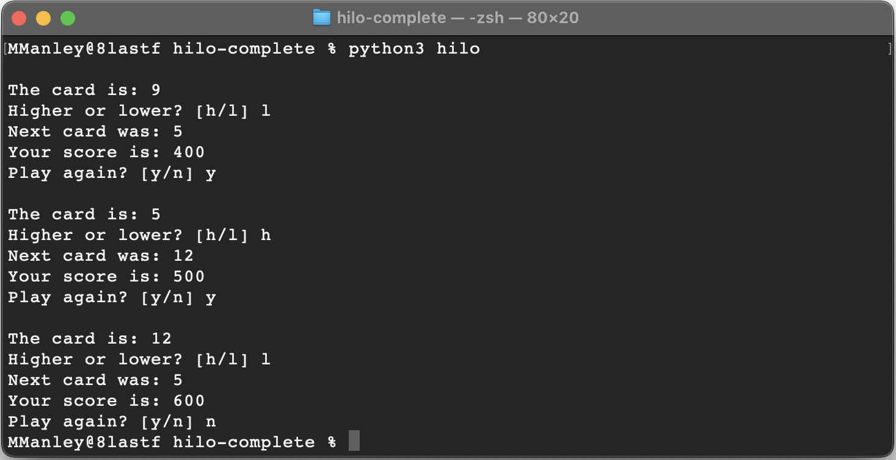

# CSE210Team8
##  Kenneth :  _kyl03001@byui.edu_   
## Cai :  _caiwoods11@byui.edu_
## Alex : cha21080@byui.edu
### 1/21/2022

<br>
<br>

## Creator Specs:<br>

Game Set Up 
```python 
from game.card import Card

class Director:
    # set card to string
    # set playing to True
    # start with 300 points
    def __init__(self):
        self.card = ""
        self.is_playing = True
        self.score = 300
        
    # start game play
    def start_game(self):
        
        # while loop for steps in game 
        while self.is_playing:
            print("")
            self.get_card1()
            self.get_hilo()
            self.get_card2()
            self.display_score()
            self.play_again() 
```
Make class Card in card.py file
```python 
import random

class Card:

    def __init__(self):
        self.value = 0

    def draw(self):
        self.value = random.randint(1, 13)
        return self.value

```

 - 1. Displays first card

```python 
    # Step one: Get first card -- Call from card.py for draw card action. 
    def get_card1(self):
        self.card1 = Card.draw(self)
        print(f"The card is: {self.card1}")
```

 - 2. Is next card going to be higher or lower?

```python 
    # Step two: Player choose High or Low.
    def get_hilo(self):
        self.choice = ""
        while not (self.choice.lower() == "l" or self.choice.lower() == "h"):
            self.choice = input("Higher or lower? [h/l] ")
```

 - 3. Displays the next card

```python 
    # Step three: Get the next card -- Call from card.py for draw card action.
    def get_card2(self):
        self.card2 = Card.draw(self)
        while self.card2 == self.card1:
            self.card2 = Card.draw(self)
        print(f"Next card was: {self.card2}")
```

 - 4. Displays updated Score

```python 
    # Step four: Determine score by testing card1 vs. card2 and hilo input.
    def display_score(self):
        if self.card1 > self.card2 and self.choice.lower() == "l":
            self.score += 100
            print(f"Correct! Your new score is: {self.score}")
        elif self.card1 < self.card2 and self.choice.lower() == "h":
            self.score += 100
            print(f"Correct! Your new score is: {self.score}")
        elif self.card1 > self.card2 and self.choice.lower() == "h":
            self.score -= 75
            print(f"Incorrect: Your new score is: {self.score}")
        elif self.card1 < self.card2 and self.choice.lower() == "l":
            self.score -= 75
            print(f"Incorrect: Your new score is: {self.score}")
        else:
            self.score = self.score  
            print("Something Goofed here...") 
```

 - 5. Play again?

```python 
    # Step five: Check if user has less than 0 points and end game or Ask user if they want to play again.
    def play_again(self):
        if self.score <= 0:
            print("\nGAME OVER: Your ran out of points")
            self.is_playing = False
        else:
            again = input(f"Play Again? [y/n] ")
            if again.lower() == "n":
                self.is_playing = False
                print("\nThank you for playing!")
```
Run in main file 

```python
from game.director import Director

director = Director()
director.start_game()
```
<br>

<b> Example:
<br>
<br>

<br>
<br>

## Game Play Directions:
   - The player starts the game with 300 points. <br>
   - Individual cards are represented as a number from 1 to 13.<br>
   - The current card is displayed.<br>
   - The player guesses if the next one will be higher or lower.<br>
   - The the next card is displayed.<br>
   - The player earns 100 points if they guessed correctly.<br>
   - The player loses 75 points if they guessed incorrectly.<br>
   - If a player reaches 0 points the game is over.<br>
   - If a player has more than 0 points they decide if they want to keep playing.<br>
   - If a player decides not to play again the game is over. <br>


